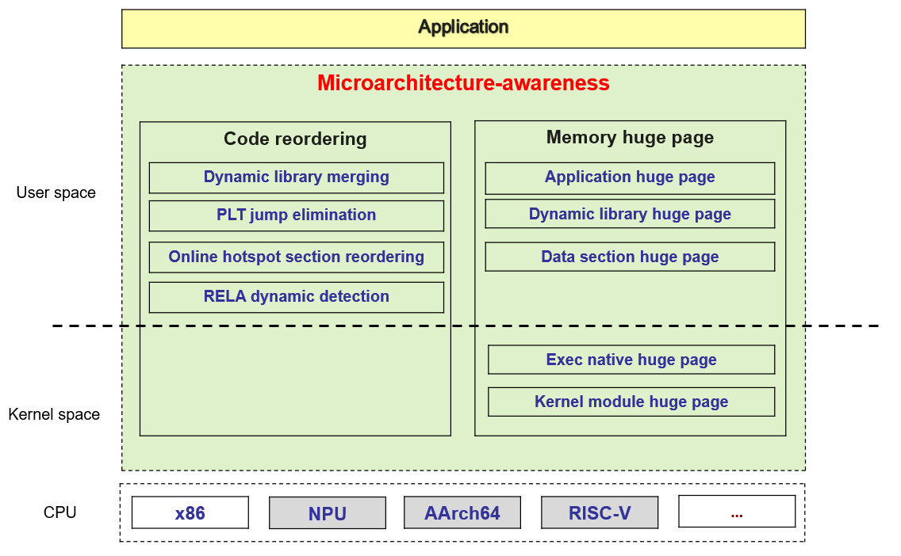

# Getting to Know sysBoost

## Introduction

sysBoost reorders the code of executable files and dynamic libraries online to adapt the code for the CPU microarchitecture of the operating environment, boosting program performance.

## Background

- Large-scale applications use a large number of third-party or self-developed dynamic libraries. A large number of PLT jumps occur during function invoking. As a result, the instructions per cycle (IPC) decreases.

- Assembly code is large in size and occupies a large amount of memory, resulting in a high iTLB miss rate. Hotspot code segments are scattered. As a result, the I-cache miss rate is high, affecting the CPU pipeline efficiency.

- Application developers are unfamiliar with the OS and CPU microarchitecture, resulting in high IPC performance optimization costs.

## sysBoost Design

### Key technologies

- Dynamic library merging: Scattered code segments and data segments are merged when the dynamic loader loads dynamic libraries. Huge page memory is used to improve the iTLB hit ratio.

- PLT jump elimination: When the application code calls a dynamic library function, the execution is redirected to the PLT and then to the actual function. Eliminating PLT jump can improve the IPC.

- Online reordering of hotspot code segments: By default, code is arranged by dynamic library. The online reordering technology can reorder hotspot code by segment.

- exec native huge page mechanism: The user-mode huge page mechanism requires specific application configuration and recompilation. The exec native huge page mechanism directly uses huge page memory when the kernel loads the ELF file,without the need for modifying applications.

### Architecture

**Figure 1** sysBoost architecture

## sysBoost Features

- Full static merging: Applications and their dependent dynamic libraries are merged into one binary file, and segment-level reordering is performed. Multiple discrete code segments or data segments are merged into one to improve application performance.

- Automatic binary file optimization: The sysBoost daemon reads the configuration file to obtain the binary files to be optimized and the corresponding optimization methods, optimizes the binary files based on user requirements, and stores the optimized binary files in RTO files.

- Huge page preloading of binary code segments/data segments: When the user-mode page table is mapped to the physical memory, huge page (2 MB) mapping can improve performance. However, openEuler does not support huge page mapping of file pages. sysBoost provides the huge page pre-loading function. After binary optimization is complete, sysBoost immediately loads the content to the kernel as a huge page. When an application is started, sysBoost maps the pre-loaded content to the user-mode page table in batches to reduce page faults and memory access delay of the application, thereby improving the application startup speed and running efficiency.

- Binary exception monitoring: If a bug occurs in the RTO binary file generated by sysBoost, the application may crash. To avoid repeated application starts and crashes and prevent the fault from spreading, sysBoost monitors the processes that load the RTO binary files. If such a process crashes, sysBoost rolls back the optimization by deleting the RTO file and the flag on the original application file. In addition, sysBoost renames the configuration file to prevent optimization from being applied again after the sysBoost service is restarted.

## Benefits

### Scenario 1

In the Bash test of UnixBench, some common commands and scripts are executed, such as `ls`, `grep`, and `awk`. These commands and scripts usually invoke some system libraries, such as **libc** and **libpthread**. These library files usually need to be dynamically linked, which increases the program startup time and delay. By using the binary file merging technology, these library files can be merged into an executable file, significantly improving the Bash performance and increasing the UnixBench score.

### Scenario 2

The dynamic assembly design of some applications uses a large number of dynamic libraries, which brings the following problems:

- Indirect function jump and scattered code segments affect CPU execution efficiency.
- The parsing of excessive dynamic library symbols slows down program startup.
- Profile-guided optimization based on a specific service model cannot adapt to different service models.

Using sysBoost to start large processes during service deployment can effectively solve the preceding problems.

- The exec huge page mechanism allows the loaded large processes to store code segments and data segments in memory huge pages, reducing the TLB miss rate.
- A large process contains all dynamic library code and application code, eliminating indirect function jumps.
- Service changes are intelligently identified online to regenerate large processes based on appropriate hotspot models.
