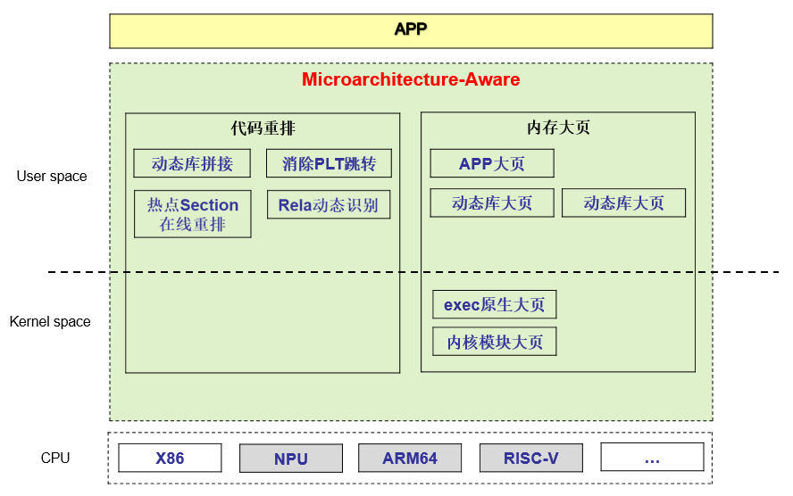

# 认识sysBoost

## 概述

通过代码重排技术对可执行文件和动态库文件在线重排操作，优化代码与运行环境的CPU微架构的适应性，提升程序性能。

## 问题背景

- 大型APP应用，使用大量的第3方或自研动态库，函数调用产生大量PLT跳转导致IPC指令执行效率下降。

- 汇编代码体积大内存占用大，导致iTLB miss概率高。热点代码段布局离散，导致iCache miss高，影响CPU流水线执行效率。

- 应用开发者对操作系统与CPU微架构不熟悉，IPC性能调优成本过大。

## 设计方案

### 关键技术

- 动态库拼接：通过ld加载阶段将分散的动态库的代码段数据段拼接聚合，然后使用大页内存提升iTLB命中率。

- 消除PLT跳转：应用代码调用动态库函数的流程，需要先跳转PLT表，然后跳转真实函数，消除PLT跳转能提升IPC。

- 热点Section在线重排：默认情况下代码段是按动态库粒度排布的，通过在线重排技术可以实现热点代码按Section粒度重排。

- exec原生大页：用户态大页机制需要应用修改配置和重编译，exec原生大页机制直接在内核加载ELF文件阶段使用大页内存，对APP透明。

### 架构

**图 1**  sysBoost设计总体方案

## sysBoost支持的功能特性

- 支持全静态合并场景：将应用与其依赖的动态库合并为一个二进制，并进行段级别的重排，将多个离散的代码段/数据段合并为一个，提升应用性能。

- 自动对系统中的二进制进行优化：sysBoost守护进程读取配置文件获取需要优化的二进制以及对应的优化方式，按照用户的要求进行优化，并将优化好的二进制存储在.rto后缀的文件中。

- 二进制代码段/数据段大页预加载：用户态页表映射物理内存时，使用大页（2M）映射可以提升性能，而当前openeuler不支持文件页的大页映射。sysBoost提供大页预加载的功能，在二进制优化完成后立即将其内容以大页形式加载到内核中，在应用启动时将预加载的内容批量映射到用户态页表，减少应用的缺页中断和访存延迟，提升启动速度和运行效率。

- 二进制异常监控：如果sysBoost生成的.rto二进制出现BUG，应用可能会crash。为了避免应用被反复拉起，反复crash等严重后果，防止故障扩散，sysBoost会对加载.rto二进制的进程进行监控。如果发现这样的进程发生了crash，sysBoost会回退优化，将该.rto文件和原应用文件的标记删除；同时也会将配置文件重命名，防止下次sysBoost服务重启后再次进行优化。

## 价值概述

### 场景一

在UnixBench的Bash测试中，通常会执行一些常见的命令和脚本，例如 ls、grep、awk 等。这些命令和脚本通常会调用一些系统库，例如 libc、libpthread 等，这些库文件通常需要动态链接。由于动态链接会增加程序的启动时间和延迟，因此采用二进制合并技术将这些库文件合并到可执行文件中，可以显著提高Bash的性能，从而提高UnixBench的得分。

### 场景二

云核等产品组件动态可装配设计, 使用大量动态库，带来了以下问题：

- 动态库机制引入函数间接跳转和代码布局离散问题, 导致CPU执行效率降低。
- 动态库大量的符号解析过程, 影响程序启动速度。
- 基于特定业务模型的预先离线编译优化(Profile-Guided Optimization), 无法适应不同业务模型变化。

在业务进程现网部署阶段, 通过sysBoost生成大进程可有效解决上述问题：

- 通过自研exec大页机制加载大进程, 使代码段和数据段利用大页内存, 降低TLB miss。
- 大进程包含所有动态库代码和应用代码，消除函数间接跳转问题。
- 智能识别业务, 选择合适的热点模型, 重新生成大进程，在线适应业务变化。
